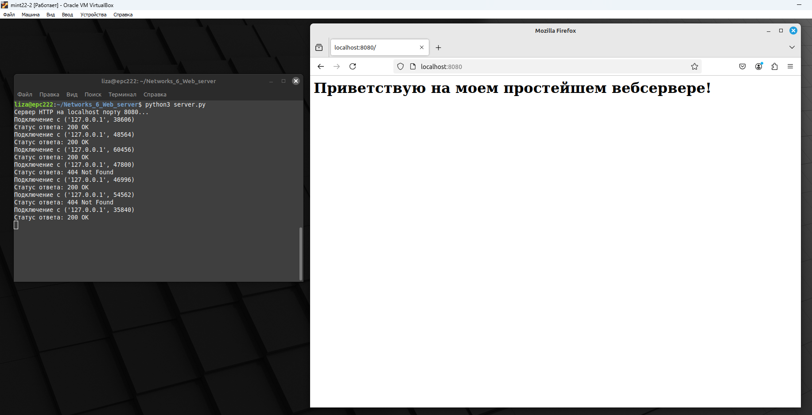
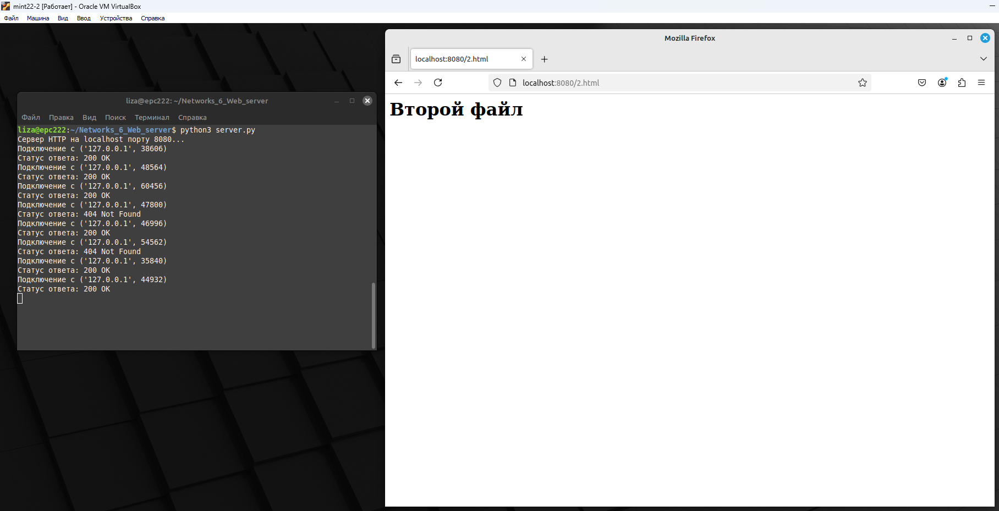
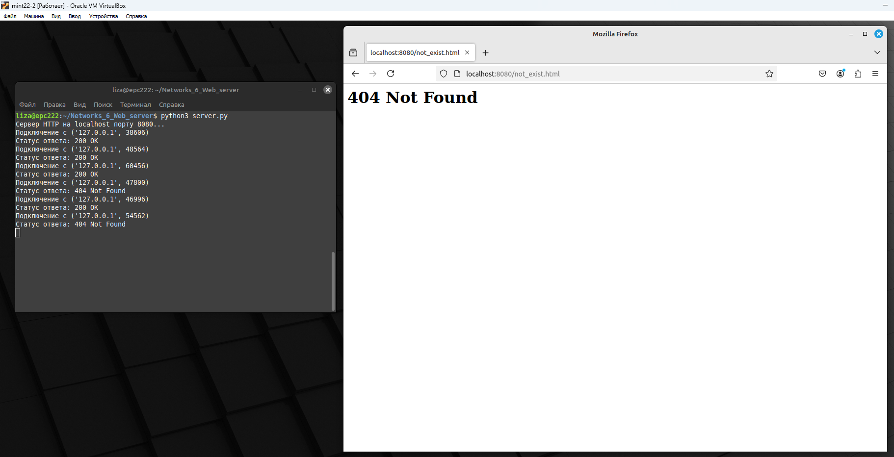

## Низкоуровневая работа с веб

### Цель работы

Освоить основные навыки обращения c Web из программы на Python, средства парсинга веб-страниц, соответствующие библиотеки.

### Задания для выполнения

1. Написать простейший веб-сервер. Сервер должен принимать входящие соединения на порту 80 и отдавать пользователю содержимое запрошенного ресурса из определенной директории (рабочей директории сервера).
2. Разместите в рабочей директории сервера простой веб сайт, содержащий страницу index.html. Убедитесь, что при подключении к серверу, если не указан необходимый ресурс он отдает содержимое страницы index.html.
3. Познакомьтесь со спецификацией протокола HTTP. Узнайте, в каком формате клиент посылает запрос серверу и в каком формате сервер посылает ответ клиенту. Особое внимание уделите полям заголовка.
4. Сделайте так, чтобы к вашему серверу можно было обращаться по протоколу HTTP. Для этого не нужно реализовывать поддержку всех возможных нюансов, вам нужно лишь описать общий формат запросов и ответов и поддерживать некоторые поля заголовков.
5. Проверьте работу вашего сервера, обратившись к нему из адресной строки любого браузера. Для этого достаточно написать в ней адрес хоста, на котором работает сервер (localhost тоже подходит). Вы должны увидеть содержимое (не код) вашей страницы. 

### Дополнительные задания

1. При ответе вашего сервера посылайте некоторые основные заголовки:
    1. Date
    2. Content-type
    3. Server
    4. Content-length
    5. Connection: close.

### Результат:

#### Задание выполнено
Если не указан необходимый ресурс, мы получаем содержимое index.html

Сервер выдает ресурс по запросу (если он существует в рабочей директории)

Если ресурса не существует, получаем 404

<!-- Docs to Markdown version 1.0β17 -->
